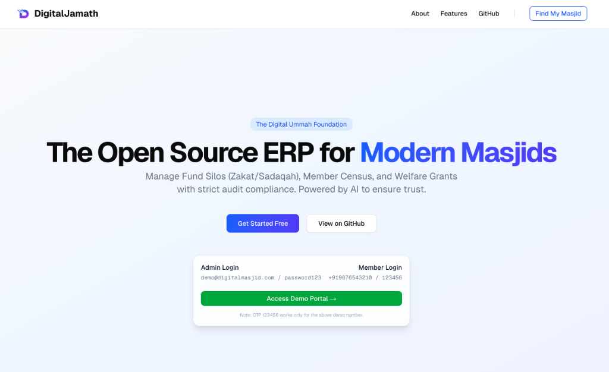

# DigitalJamath


**DigitalJamath** is an open-source, production-grade SaaS ERP for Indian Masjids, Jamaths, and Welfare organizations. It provides a robust multi-tenant architecture to handle census data, financial management (Baitul Maal), welfare distribution, and community engagement.

<p align="center">
  
</p>

<p align="center">
  
</p>

---

## 🆕 What's New in v1.1.10 Alpha
- **Interactive Onboarding**: New wizard for registering Masjids with OTP verification and auto-provisioning.
- **CI/CD Pipeline**: Automated Docker builds via GitHub Actions for fast deployments.
- **SEO & LLM Ready**: Added `robots.txt`, `sitemap.xml`, and `llm.txt` for search engines and AI agents.

---

## ✨ Key Features

| Feature | Description |
|---------|-------------|
| **Digital Census** | Manage household and member profiles with socio-economic data |
| **Baitul Maal** | Track Zakat, Sadaqah, and operational funds with strict fund isolation |
| **Multi-Tenant** | Each Masjid gets isolated database schema (`demo.digitaljamath.com`) |
| **Welfare (Khidmat)** | Grant applications, eligibility scoring, beneficiary tracking |
| **Basira AI** | AI-powered audit assistant for anomaly detection |
| **Surveys** | Custom survey builder for community feedback |
| **Member Portal** | Self-service portal with OTP login for members |

---

## 🛠 Tech Stack

| Layer | Technology |
|-------|------------|
| **Backend** | Python 3.11+, Django 5.0, Django REST Framework |
| **Multi-Tenancy** | django-tenants (PostgreSQL Schema Isolation) |
| **Database** | PostgreSQL 16+ |
| **Frontend** | Next.js 16, React 19, TypeScript |
| **Styling** | Tailwind CSS + Shadcn UI |
| **Containerization** | Docker + Docker Compose |
| **CI/CD** | GitHub Actions → GitHub Container Registry |
| **Email** | Brevo SMTP |
| **AI** | OpenRouter (Gemini/Llama) |

---

## 📦 Project Scripts

| Script | Purpose |
|--------|---------|
| `setup.sh` | Interactive installer - sets up dev or prod environment |
| `deploy.sh` | Fast production deployment - pulls pre-built images (~30 sec) |
| `scripts/bump_version.sh` | Updates version across all files and creates git tag |
| `scripts/populate_demo_data.py` | Populates sample data for testing |

---

## 🚀 Quick Start

### Option 1: Production (Recommended)

```bash
# Clone and configure
git clone https://github.com/azzaxp/digitaljamath.git
cd digitaljamath
cp .env.example .env
nano .env  # Set DATABASE_PASSWORD, DOMAIN_NAME, etc.

# Start with pre-built images
docker-compose -f docker-compose.prod.yml up -d
```

### Option 2: Interactive Setup

```bash
git clone https://github.com/azzaxp/digitaljamath.git
cd digitaljamath
./setup.sh  # Follow prompts for dev or prod setup
```

### Future Updates

```bash
git pull origin main
./deploy.sh  # Pulls new images, restarts frontend (~30 seconds)
```

---

## 💻 Development Setup

```bash
# Clone repository
git clone https://github.com/azzaxp/digitaljamath.git
cd digitaljamath

# Backend setup
python -m venv venv
source venv/bin/activate
pip install -r requirements.txt
cp .env.example .env
python manage.py migrate
python manage.py runserver

# Frontend setup (new terminal)
cd frontend
npm install
npm run dev
```

Access: http://localhost:3000 (frontend) | http://localhost:8000 (backend)

---

## 📋 Post-Installation

### 1. Seed Chart of Accounts (Required)

```bash
# Docker
docker exec -it digitaljamath_web python manage.py tenant_command seed_ledger --schema=<schema_name>

# Development
python manage.py seed_ledger
```

### 2. Create Admin User

```bash
# Docker
docker exec -it digitaljamath_web python manage.py createsuperuser

# Development
python manage.py createsuperuser
```

### 3. Populate Demo Data (Optional)

```bash
docker exec -it digitaljamath_web python scripts/populate_demo_data.py --schema=demo
```

---

## ⚙️ Configuration

Copy `.env.example` to `.env` and set:

| Variable | Description | Example |
|----------|-------------|---------|
| `SECRET_KEY` | Django secret key | `your-random-string` |
| `DEBUG` | Debug mode | `False` |
| `DOMAIN_NAME` | Base domain | `digitaljamath.com` |
| `DATABASE_PASSWORD` | PostgreSQL password | `StrongPassword123` |
| `BREVO_SMTP_KEY` | Email API key | `xkeysib-...` |

> ⚠️ Never commit `.env` to version control!

---

## 📦 Multi-Tenancy

DigitalJamath uses **PostgreSQL Schema Isolation**:

- **Public Schema**: Tenant registry (`Client`, `Domain` tables)
- **Tenant Schemas**: Each Masjid has completely isolated tables

**Create a new tenant:**
1. Login to `/admin`
2. Go to **Clients** → **Add Client**
3. Set schema name and domain (e.g., `newmasjid.digitaljamath.com`)
4. Migrations run automatically!

---

## 🤝 Contributing

We welcome contributions!

**Looking for:**
- Django Developers (backend features)
- Next.js Developers (frontend polish)
- Testers (bug hunting and QA)
- Shariah Analysts (financial logic verification)

**How to contribute:**
1. Fork the repository
2. Create feature branch: `git checkout -b feature/AmazingFeature`
3. Commit changes: `git commit -m 'Add AmazingFeature'`
4. Push and open a Pull Request

---

## 📄 License

MIT License - See [LICENSE](LICENSE) for details.

---

## 🔗 Links

| Resource | URL |
|----------|-----|
| **Website** | [digitaljamath.com](https://digitaljamath.com) |
| **Live Demo** | [demo.digitaljamath.com](https://demo.digitaljamath.com) |
| **Documentation** | [DEPLOYMENT.md](DEPLOYMENT.md) |
| **GitHub** | [github.com/azzaxp/digitaljamath](https://github.com/azzaxp/digitaljamath) |
