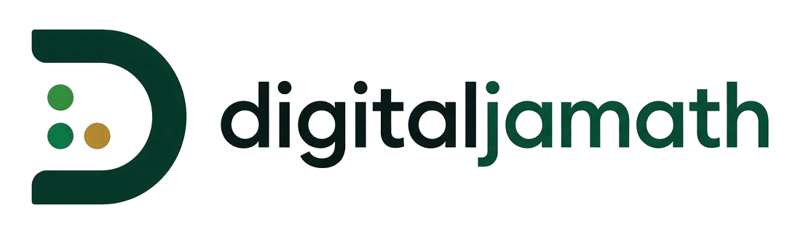
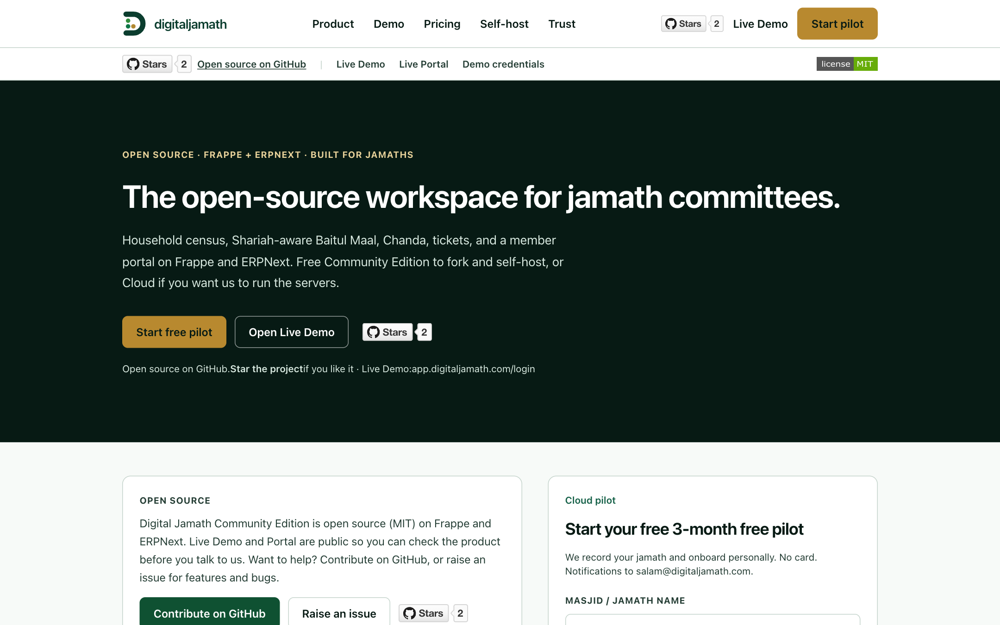
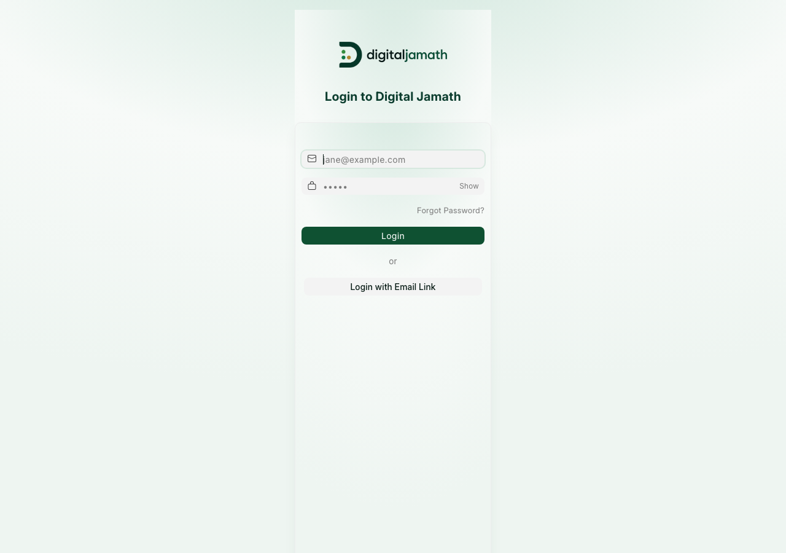
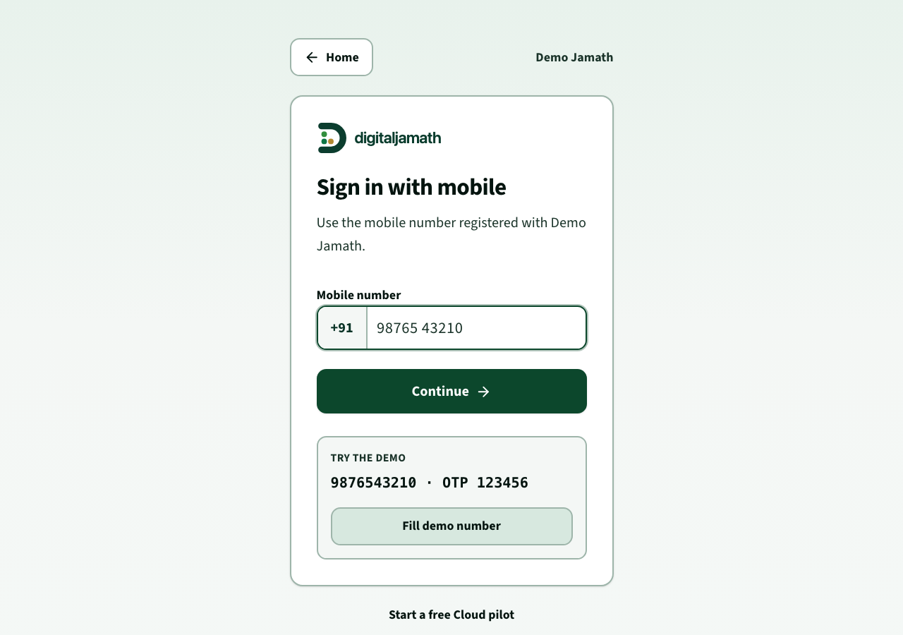
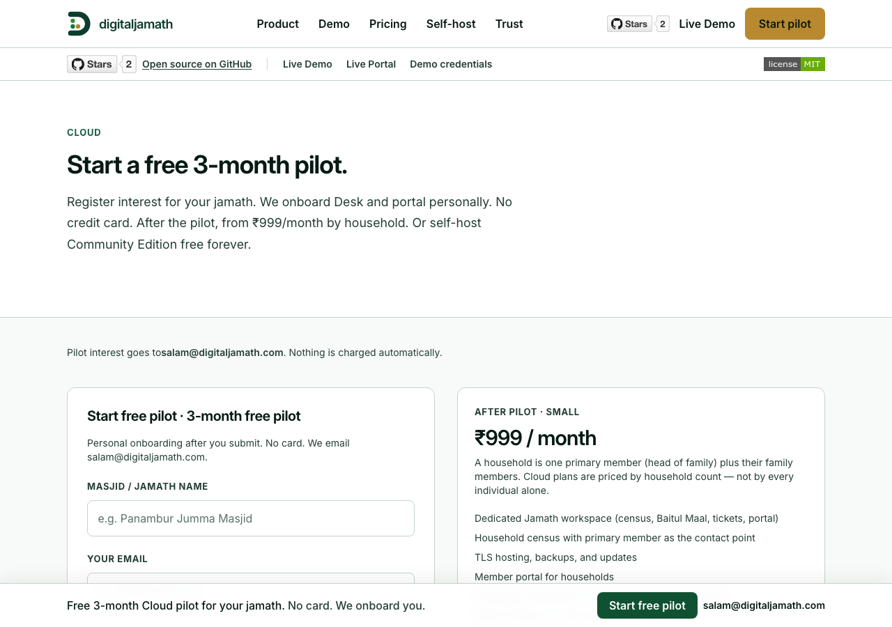

<p align="center">
  
</p>

<p align="center">
  <strong>Open-source community-trust software for jamaths and masjids</strong><br />
  Household census · Shariah-aware Baitul Maal · Member portal · Compliance
</p>

<p align="center">
  <a href="https://github.com/digitaljamath/digitaljamath/releases/tag/v0.1.0"></a>
  <a href="LICENSE"></a>
  
  <a href="https://github.com/digitaljamath/digitaljamath/stargazers"></a>
</p>

<p align="center">
  <a href="https://digitaljamath.com">Website</a>
  ·
  <a href="https://app.digitaljamath.com/login">Live Demo</a>
  ·
  <a href="https://digitaljamath.com/portal/login">Member portal</a>
  ·
  <a href="https://digitaljamath.com/cloud#interest-form">Start free pilot</a>
  ·
  <a href="DEPLOYMENT.md">Deploy</a>
</p>

---

## Mission

**One job: community trust.**

Digital Jamath helps jamath committees run membership, sacred funds, receipts, and member services with dignity and an audit trail they can defend. It is not donation SaaS. It is free, MIT-licensed software on Frappe and ERPNext, shaped for Muslim community institutions worldwide, with India compliance as a locale pack.

| Pillar | What it means |
|--------|----------------|
| **Open source** | Forkable, no lock-in, public by default |
| **Community first** | Jamath = people assembled with purpose |
| **Trustworthy** | Ledgers, receipts, and roles you can explain to the committee |
| **Modern** | Clear software UI, not ornamental clichés |
| **Self-host or Cloud** | Same product either way |

> Built with care for the Ummah. Contact: [salam@digitaljamath.com](mailto:salam@digitaljamath.com)

---

## Screenshots

### Website

<p align="center">
  
</p>

### Committee Desk (Live Demo login)

<p align="center">
  
</p>

### Member portal

<p align="center">
  
</p>

### Cloud pilot

<p align="center">
  
</p>

---

## What you get

| Module | What committees use it for |
|--------|----------------------------|
| **Census** | Households with a primary member, family on the card, membership IDs |
| **Baitul Maal** | Zakat, Sadaqah, Construction, and General kept apart; restricted funds blocked on submit |
| **Receipts & compliance** | Digital receipts; India pack for 80G-style and Form 10BD CSV |
| **Tickets** | Nikah, NOC, certificates, and other member requests |
| **Member portal** | OTP login, family view, donations, service requests |
| **Basira** | Optional AI guide (bring your own key when self-hosting) |

Community Edition is the full product. Cloud pays for servers, backups, and onboarding, not feature locks.

**Stable release:** [v0.1.0](https://github.com/digitaljamath/digitaljamath/releases/tag/v0.1.0)

---

## Try it in 60 seconds

| Surface | Sign in |
|---------|---------|
| **Committee Desk** | [app.digitaljamath.com/login](https://app.digitaljamath.com/login) → `demo@digitaljamath.com` / `Experience@DJ1` |
| **Member portal** | [digitaljamath.com/portal/login](https://digitaljamath.com/portal/login) → phone `9876543210`, OTP `123456` |

Demo data resets every night (IST). Ready for your jamath? [Start a free 3-month Cloud pilot](https://digitaljamath.com/cloud#interest-form) (no credit card).

---

## Community Edition vs Cloud

| | **Community Edition** (this repo) | **Digital Jamath Cloud** |
|--|-----------------------------------|--------------------------|
| Price | Free forever | 90-day pilot, then from **₹999/mo** by household |
| Who runs it | You (Docker / your VPS) | We host and onboard |
| Software | Full modules | Same app |
| Data | Yours. Export anytime | Yours. Leave for CE whenever |
| Billing unit | — | Household = primary + family |

After pilot: Small ₹999 (≤150 households) · Growth ₹1,999 · Community ₹3,499 · Ummah custom.

---

## Quick start (self-host)

```bash
git clone https://github.com/digitaljamath/digitaljamath.git
cd digitaljamath
git checkout main   # stable v0.1.0 line; or checkout the tag: git checkout v0.1.0
cp .env.example .env
docker compose up -d
bash scripts/frappe_bootstrap.sh
```

Open Desk from `.env` (default port `8000`). Seed the masjid chart of accounts:

```bash
bash scripts/seed_masjid_coa.sh
```

Full guide: **[DEPLOYMENT.md](DEPLOYMENT.md)**.

---

## Logo and brand

Canonical mark: **Open-D** + lowercase wordmark `digitaljamath`.

<p align="center">
  
</p>

- Forest green `#0B3D2E`, leaf and gold accents in the D
- Meaning: the jamath lives inside open software
- Assets in `digital_jamath/public/images/` (lockup, mark, favicons)

Do not use crescents, minarets, or calligraphy in the mark. Prefer Inter / system UI for product screens.

---

## Repository layout

```
digital_jamath/     # Frappe app (source of truth)
docker-compose.yml  # MariaDB + Redis + ERPNext + app
scripts/            # Bootstrap, COA, cloud helpers
docs/               # Architecture, licensing, lead routing, screenshots
legacy_django/      # Frozen Django snapshot (tag v2.1.0-django-legacy)
```

| Sibling | Role |
|---------|------|
| [digitaljamath-astro](https://github.com/digitaljamath/digitaljamath-astro) | Marketing → [digitaljamath.com](https://digitaljamath.com) |
| [digitaljamath-website](https://github.com/digitaljamath/digitaljamath-website) | Member portal → `/portal` |

---

## Contributing

Want to help? Use GitHub:

- [Contribute](https://github.com/digitaljamath/digitaljamath) (prefer PRs against `dev`)
- [Raise an issue](https://github.com/digitaljamath/digitaljamath/issues/new) for features and bugs
- Star the repo if it helps your jamath

Welcome: Frappe/Python, portal (Next.js), Astro content, Shariah review, and translations.

`legacy_django/` is read-only.

---

## License

[MIT](LICENSE) for the Community Edition app. Frappe Framework is MIT; ERPNext is GPL-3. Fork it, self-host it, keep the jamath free.

All questions: **[salam@digitaljamath.com](mailto:salam@digitaljamath.com)**

---

<p align="center"><em>Built with care for the Ummah. اللهم بارك</em></p>
