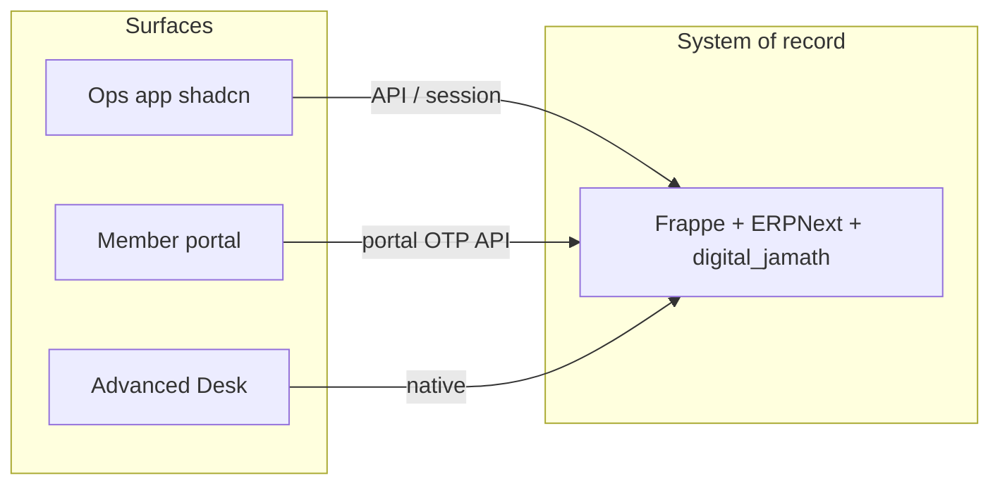

# Digital Jamath — Ops app & Advanced Desk plan

**Status:** agreed direction · **Stack:** Frappe/ERPNext = system of record · Ops UI = default for trustees

---

## Product principle

Digital Jamath is **jamath software** that happens to run on Frappe/ERPNext — not “ERPNext with a theme.”

| Mode | Audience | Experience |
|------|----------|------------|
| **Ops** (default) | Mutawallis, clerks, treasurers | Simple SaaS UI (shadcn): households, collect/pay, grants, staff, tickets, compliance |
| **Advanced Desk** | Accountants, admins | Full ERPNext: COA, JE dimensions, Users, custom reports |
| **Member portal** | Households | Existing Next OTP portal |

---

## Architecture

- **Do not** rebuild double-entry or Fund Type isolation in the Ops UI — call `record_quick_entry`, list DocTypes via API.
- App switcher: Ops ↔ Advanced Desk (`app.digitaljamath.com`).

---

## Phased delivery

### Phase 0 — Brand & Desk hygiene (now)
- [x] Open-D logo + favicon on Desk assets
- [x] Digital Jamath workspace hub + navigation escape hatch
- [x] Demo seed: funds, JE, grants, **staff + salaries + compliance**

### Phase 1 — Ops shell (**shipped as `/jamath` on Frappe**, Kamra-style SPA)

> **Decision update:** Implemented as Vite/React inside `digital_jamath` at `/jamath` (same pattern as Kamra PMS), not `/ops` on Next. Member portal stays Next-only. See [FEATURES.md](FEATURES.md) §9 and `committee-ui/README.md`.

- [x] Auth: Desk user session cookie + CSRF
- [x] Shell: Home · Community · Baitul Maal · Services · Welfare · Settings · **Advanced → Desk**
- [x] Home shortcuts + list stubs for core DocTypes
- [ ] Quick collect/pay, in-console forms, ⌘K, role-gated nav

### Phase 2 — Core workflows
- Households list/detail (wrap Jamath Household)
- Collect / Pay (wrap `quick_entry`)
- Grants list + status
- Staff directory + monthly salary action
- Compliance checklist board

### Phase 3 — Cloud default
- New Cloud tenants open Ops first
- Desk linked as Advanced only
- Optional: hide ERP module noise further for non-accountant roles

---

## Seed data (Demo Jamath) — staff & compliance

**Jamath Staff:** Imam, Muezzin, Clerk, Accountant, Cleaner — salary, fund, PAN/Aadhaar last-4, PF/ESI flags, contract & police verification.

**Jamath Compliance Item:** registration, 80G, Form 10BD, PF, ESI, FCRA N/A, banking, data privacy.

**Ledger:** monthly salary Journal Entries tagged `[DEMO-SEED] Salary — …`

---

## Explicit non-goals (near term)

- Full HRMS (Attendance, Salary Slip structures) — use Jamath Staff until needed
- Replacing ERPNext GL / Chart of Accounts UI in Ops
- Building Ops inside Desk (no Frappe UI rewrite)

---

## Decision lock

| Choice | Decision |
|--------|----------|
| Ops host | **`/jamath` on Frappe app** (SPA); `/ops` on Next deferred |
| Desk | Advanced mode only for day-to-day users |
| Accounting | Stay on ERPNext JE + Fund Type dimension |
